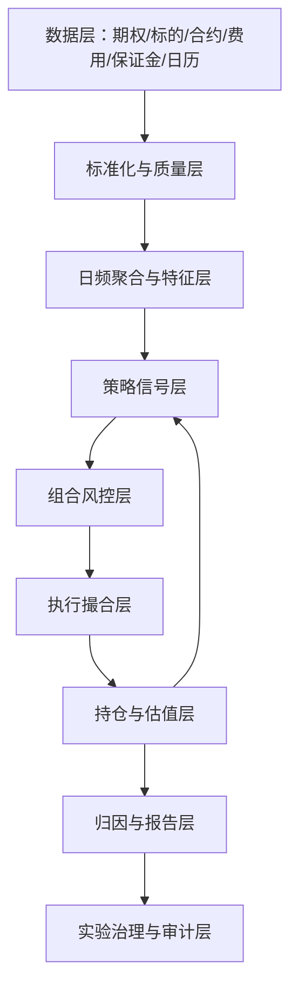
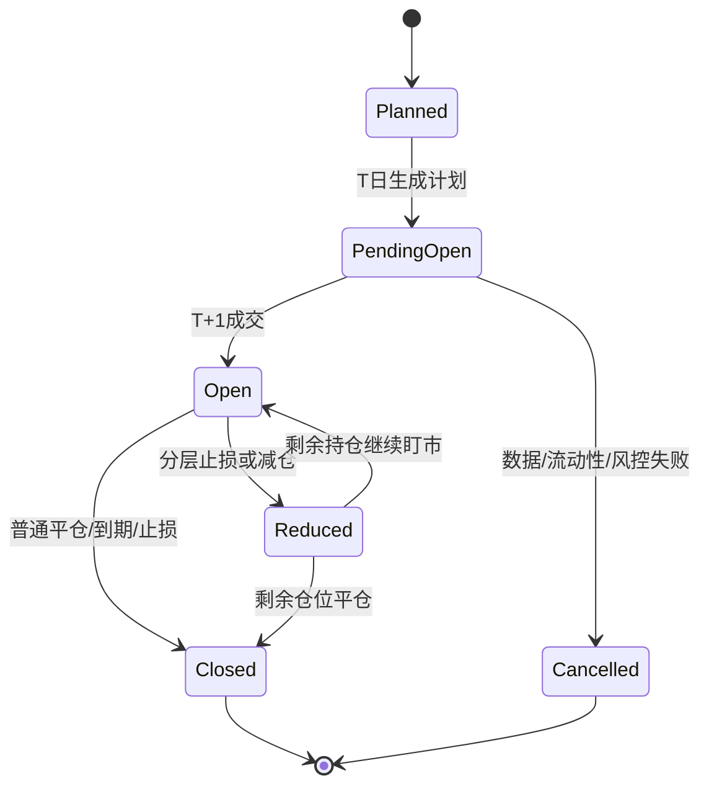

# 公司级期权回测系统需求说明书

日期：2026-05-06  
提交方：期权策略研究  
适用对象：IT、数据平台、量化研究、风控、交易支持  
文档定位：本文是公司级期权回测系统的业务与技术需求说明，不是某一个策略的代码说明。当前研究系统可作为参考，但目标系统应按公司级、可扩展、可审计、可复现的标准重新设计。

## 1. 建设背景

目前期权策略研究已经从单一脚本回测发展到多品种、多策略、多实验、多报告的研究流程。现有研究系统已经覆盖商品期权、股指期权、ETF 期权的分钟数据读取、日频聚合、IV/Greeks 计算、保证金、费用、滑点、盘中止损、组合风控、结果归因和实验报告。

但现有系统本质仍是研究工程，主要目标是快速验证策略想法。随着策略研究进入模拟盘准备和公司内部复用阶段，单一研究脚本已经无法满足以下要求：

- 多研究员并行使用。
- 多策略、多市场、多频率统一回测。
- 数据口径、成交口径、保证金口径可审计。
- 回测结果可复现、可追溯、可对比。
- 支持长周期全品种回测和批量参数实验。
- 输出可直接服务投研、风控、模拟盘评审和管理层汇报。

因此需要建设一套公司级期权回测系统，把当前研究系统中已经验证过的经验沉淀为平台能力，同时解决研究脚本阶段的工程限制。

## 2. 建设目标

公司级期权回测系统的目标不是只跑通某一个策略，而是提供一个统一、严谨、高性能、可扩展的期权策略研究底座。

核心目标如下：

| 目标 | 说明 |
|---|---|
| 多市场覆盖 | 支持商品期权、股指期权、ETF 期权，并能按交易所差异处理合约、标的、保证金、费用和行权。 |
| 多策略接入 | 支持纯卖权、比例价差、日历价差、保护结构、对冲结构、组合策略等策略插件。 |
| 日频与分钟混合 | 支持日频信号、T+1 执行、分钟级止损或风控，也支持纯日频与更高频扩展。 |
| 无未来函数 | 所有信号、排序、开仓、止损、估值、归因必须严格遵守时间因果。 |
| 真实交易约束 | 支持成交量、持仓量、报价宽度、滑点、手续费、保证金、涨跌停、缺失行情、异常价过滤。 |
| 风险穿透 | 支持单合约、品种、板块、相关组、到期日、策略、账户层面的风险约束和压力测试。 |
| 实验治理 | 支持配置版本、实验队列、结果审计、基准对比、样本内外切分和报告自动生成。 |
| 高性能 | 支持 2022 年以来全品种、分钟级执行逻辑的长周期回测，单日处理速度需要可控且可扩展。 |

## 3. 系统边界

### 3.1 必须覆盖的市场

| 市场 | 交易所 | 标的类型 | 主要注意事项 |
|---|---|---|---|
| 商品期权 | SHFE、INE、DCE、CZCE、GFEX | 期货合约 | 标的是期货；夜盘、主力合约、到期交割、保证金、涨跌停、流动性差异非常重要。 |
| 股指期权 | CFFEX | 指数 | 合约乘数、现金结算、指数标的、股指期货替代标的、交易费用和保证金口径要单独处理。 |
| ETF 期权 | SSE、SZSE | ETF | ETF 复权、合约单位调整、除权除息、行权交收、ETF 与指数口径差异要单独处理。 |

### 3.2 必须支持的策略类型

第一阶段优先支持以下策略类型：

| 策略族 | 示例 | 系统能力要求 |
|---|---|---|
| 纯卖权 / 空波动率 | 卖 Put、卖 Call、卖跨式/宽跨 | 需要 IV/RV、Theta/Vega/Gamma、权利金止损、保证金与组合压力测试。 |
| 价差结构 | 牛熊价差、信用价差、保护腿卖权 | 需要多腿组合、净权利金、腿间成交、最大亏损、保证金抵减。 |
| 比例价差 | 买近卖远、1:N ratio、断翅蝶转换 | 需要多腿结构、局部 long gamma、尾部 short gamma、breakeven、tail slope。 |
| 日历 / 跨期结构 | 近月卖、远月买或反向 | 需要期限结构、跨到期 Greeks、换月与期限风险。 |
| 对冲与组合策略 | 期货/ETF 对冲、Delta overlay | 需要期货/ETF 交易、保证金联动、对冲成本和滑点。 |
| 因子与影子交易 | full shadow universe、候选因子标签 | 需要不改变交易的候选池输出、forward outcome、IC、分层检验。 |

第一阶段不要求完整实盘 OMS，但回测口径必须能够近似实盘执行约束，并为后续模拟盘系统对接预留接口。

## 4. 用户角色与使用场景

| 角色 | 典型需求 |
|---|---|
| 策略研究员 | 设计策略、修改配置、批量实验、查看归因、生成报告。 |
| 期权量化专家 | 审查策略逻辑、风险来源、Greeks、波动率结构、尾部风险。 |
| 风控 | 查看保证金、压力亏损、品种集中度、板块集中度、相关性突变、止损簇。 |
| IT / 数据平台 | 维护数据表、任务调度、缓存、权限、日志、性能、可用性。 |
| 交易支持 | 验证成交口径、手续费、滑点、流动性限制、模拟盘可执行性。 |
| 管理层 | 查看策略画像、净值、回撤、收益来源、风险暴露、上线准备程度。 |

### 4.1 典型业务流程

公司级系统需要覆盖从策略研究到模拟盘准备的完整流程。

| 阶段 | 使用者 | 系统动作 | 输出 |
|---|---|---|---|
| 策略假设提出 | 研究员、期权专家 | 新建策略说明和实验配置 | 策略文档、配置草案。 |
| 数据可用性检查 | 研究员、IT | 检查品种、日期、合约、标的、费用、保证金数据是否齐全 | 数据质量报告。 |
| 小样本 smoke | 研究员 | 跑少数品种、少数月份，检查订单和路径 | smoke scorecard。 |
| 长周期回测 | 研究员 | 跑全品种、长周期、指定基准 | NAV、orders、diagnostics。 |
| 审计 | 系统、风控 | 检查未来函数、异常成交、保证金、费用、数据缺失 | audit report。 |
| 期权逻辑复盘 | 期权专家 | 检查收益来源、Greeks、尾部风险、策略逻辑是否通顺 | review report。 |
| 对比实验 | 研究员 | 与基准做同期 NAV、超额、回撤、止损、Greeks 对比 | comparison report。 |
| 模拟盘准备 | 研究员、交易支持、风控 | 输出每日计划、风险预算、成交假设和监控指标 | paper trading checklist。 |

### 4.2 使用场景优先级

| 优先级 | 场景 | 第一阶段要求 |
|---|---|---|
| P0 | 单策略长周期回测 | 必须稳定支持。 |
| P0 | 基准和实验对比 | 必须按共同日期输出超额。 |
| P0 | 订单级追溯 | 每个 NAV 变化必须能追到订单和持仓。 |
| P0 | 数据质量检查 | 关键数据缺失时不能静默回退。 |
| P1 | 批量实验队列 | 支持排队、并发和失败重跑。 |
| P1 | 自动报告 | 支持图表和中文解释。 |
| P1 | 多策略组合 | 支持 S1/S3 等策略并行。 |
| P2 | 模拟盘联动 | 支持交易计划、成交回填和回测偏差分析。 |

## 5. 数据需求

期权回测最容易出现错误的地方不是策略规则，而是数据口径。系统必须把数据字段、时间戳、复权、缺失、异常、来源和可用时间管理清楚。

### 5.1 核心数据表

当前研究系统使用的表可作为第一阶段参考：

| 表名 | 当前用途 | 公司级要求 |
|---|---|---|
| `option_basic_info` | 期权合约基础信息 | 必须包含合约代码、品种、交易所、标的代码、执行价、到期日、合约类型、合约乘数、行权方式、上市日、摘牌日。 |
| `option_hf_1min_non_ror` | 期权 1 分钟行情 | 必须包含 date、time、code、open/high/low/close、volume、amount、open_interest，最好补 bid/ask。 |
| `future_hf_1min` | 期货 1 分钟行情 | 商品期权真实标的价格来源；必须支持具体期货合约和主力映射。 |
| `etf_hf_1min_non_ror` | ETF 1 分钟行情 | ETF 期权真实标的价格来源；必须处理复权和合约单位调整。 |
| 指数行情表 | 股指期权标的 | CFFEX 股指期权需要指数点位；如无指数分钟数据，需要明确替代口径。 |
| 交易日历表 | 交易日与夜盘 | 必须按交易所、品种、日盘/夜盘、节假日处理。 |
| 费用表 | 手续费、平今、行权、指派 | 必须可按品种、交易所、日期、开平、买卖方向生效。 |
| 保证金率表 | 期货/期权保证金率 | 必须可按品种、交易所、日期生效，并支持券商保证金率覆盖交易所保证金率。 |
| 品种分类表 | 板块、相关组、品种属性 | 用于组合风控、板块暴露、品种池实验。 |
| 事件表 | 宏观、产业、交易所公告 | 用于事件窗口过滤和风险解释，第一阶段可留接口。 |

### 5.2 期权合约基础字段

`option_basic_info` 至少需要以下字段：

| 字段 | 类型 | 说明 |
|---|---|---|
| `ths_code` / `option_code` | string | 期权合约唯一代码。 |
| `product` | string | 品种代码，如 CU、AU、IO、MO、510300ETF。 |
| `exchange` | string | 交易所，如 SHFE、DCE、CZCE、CFFEX、SSE、SZSE。 |
| `underlying_code` | string | 对应标的期货、ETF 或指数代码。 |
| `contract_type` | string | Call / Put。 |
| `strike_price` | float | 执行价。 |
| `maturity_date` | date | 到期日。 |
| `listed_date` | date | 上市日。 |
| `delist_date` | date | 摘牌日。 |
| `contract_multiplier` | float | 合约乘数。 |
| `exercise_style` | string | European / American。 |
| `settlement_type` | string | 现金结算 / 实物或期货交割。 |
| `min_tick` | float | 最小变动价位。 |
| `price_limit` | optional | 涨跌停参数。 |

### 5.3 分钟行情字段

期权和标的分钟数据至少需要：

| 字段 | 说明 |
|---|---|
| `date` | 交易日期。夜盘归属必须统一。 |
| `time` | 分钟时间。需要保留交易时段信息。 |
| `code` | 合约代码。 |
| `open/high/low/close` | 分钟 OHLC。 |
| `volume` | 分钟成交量。 |
| `amount` | 成交额，如有。 |
| `open_interest` | 持仓量。 |
| `bid1/ask1/bid_volume1/ask_volume1` | 强烈建议加入，用于更真实成交。 |
| `source_update_time` | 数据入库时间或供应商更新时间，用于审计。 |
| `quality_flag` | 缺失、停牌、异常跳价、疑似陈旧报价等标记。 |

### 5.4 日频派生数据

系统应内置稳定的日频聚合层，不建议每个策略单独从分钟数据重复聚合。

日频派生字段包括：

- 当日 open/high/low/close。
- 当日成交量、成交额、持仓量。
- 当日 TWAP、VWAP。
- 当日最高价和最低价，用于止损预筛。
- 当日可成交分钟数。
- 当日缺失分钟比例。
- 当日异常价格标记。
- 当日成交活跃度评分。

### 5.5 标的价格映射

系统必须优先使用真实标的价格，而不是依赖 PCP 反推。

| 市场 | 标的价格优先级 |
|---|---|
| 商品期权 | 具体标的期货合约分钟价 > 主力映射价 > 同到期 PCP 反推。 |
| ETF 期权 | ETF 真实分钟价 > 日频 ETF 收盘价 > PCP 反推。 |
| 股指期权 | 指数真实分钟价 > 股指期货近月替代价 > PCP 反推。 |

PCP 反推只能作为缺失诊断或兜底，不应作为主路径。若无有效 Call/Put 配对，不能退化成“执行价中位数”这种假 spot，应标记为不可计算并跳过相关 IV/Greeks。

### 5.6 数据质量检查

数据平台需要提供每日数据质量报告，至少包括：

- 合约基础信息缺失率。
- 合约乘数异常、非正、突变。
- 到期日、执行价、Call/Put 类型缺失。
- 期权分钟行情缺失比例。
- 标的分钟行情缺失比例。
- 成交价瞬时跳变又恢复的异常点。
- 低价期权 tick 占比过高。
- 当日无成交但价格变化的陈旧报价。
- PCP 偏离异常。
- IV 反解失败率。
- Greeks 极值异常。

### 5.7 数据可用时间要求

为避免未来函数，数据表不能只保存“最终修正后数据”，还需要明确研究回放时某个字段在当时是否可用。

| 数据 | 可用时间要求 |
|---|---|
| 分钟行情 | 只能在对应分钟结束后使用。 |
| 日频聚合 | T 日收盘后可用于 T 日信号，不能用于 T 日盘中触发。 |
| 合约基础信息 | 合约上市前可知道的字段和上市后才产生的字段要区分。 |
| 持仓量 | 若供应商日后修正，需要保留修正版本或记录版本号。 |
| 保证金率 | 必须按生效日期使用，不能用最新保证金率覆盖历史。 |
| 手续费 | 必须按生效日期使用，不能用最新费率覆盖历史。 |
| 主力合约映射 | 若使用主力，应明确是当日可知主力还是事后主力。 |
| 事件数据 | 只有公告日或提前已知日之后才能进入信号。 |

### 5.8 数据异常处理策略

公司级系统需要把异常处理做成显式规则，并在 diagnostics 中记录原因。

| 异常 | 处理要求 |
|---|---|
| 期权分钟缺失 | 若影响开仓或止损，订单应标记未成交或回退到配置指定口径，不能静默使用 0。 |
| 标的分钟缺失 | IV/Greeks 不应使用假 spot；应跳过或使用明确兜底，并记录。 |
| 价格为 0 或负数 | 不允许进入 IV/Greeks、估值和成交。 |
| 单分钟异常跳价 | 需要成交量、连续分钟、回归比例确认。 |
| 低价 tick 过大 | 需要标记 tick_value_ratio，并支持过滤或降权。 |
| 成交量极低 | 开仓和止损都应触发流动性约束。 |
| PCP 明显偏离 | 标记为数据质量风险，不应直接用于真实 spot 主路径。 |
| 合约乘数突变 | 必须判断是否为 ETF 合约单位调整或数据错误。 |
| 到期日缺失 | 合约不可交易。 |
| 行权方式缺失 | 不影响普通估值时可警告，但到期处理不可缺失。 |

### 5.9 数据服务接口需求

第一阶段不要求 IT 立即做成微服务，但代码接口应按服务边界设计。

| 接口 | 输入 | 输出 |
|---|---|---|
| `get_trading_dates` | start_date、end_date、exchange/product | 交易日列表、夜盘归属。 |
| `get_option_contracts` | date、product、exchange | 当日可交易合约基础信息。 |
| `get_option_minutes` | date、code_list、fields | 期权分钟行情。 |
| `get_underlying_minutes` | date、underlying_list、type | 期货、ETF、指数分钟行情。 |
| `get_daily_aggregate` | date、product/code_list | 日频聚合行情。 |
| `get_fee_schedule` | date、product、exchange | 生效手续费。 |
| `get_margin_schedule` | date、product、exchange | 生效保证金率。 |
| `get_product_taxonomy` | date | 板块、相关组、品种属性。 |
| `get_data_quality_report` | date、product | 缺失、异常、质量标记。 |

## 6. 回测引擎功能需求

### 6.1 总体架构

建议采用分层架构：



每一层都应有清晰输入输出，避免把所有逻辑写入一个主循环。

### 6.2 时间因果规则

系统必须严格遵守以下时间规则：

| 场景 | 要求 |
|---|---|
| 日频信号 | T 日收盘后只能使用 T 日及以前已知数据。 |
| 开仓 | T 日生成交易计划，T+1 日按指定执行口径成交。 |
| 盘中止损 | 只能使用触发时刻及以前的数据判断是否触发；若用下一分钟成交价，必须明确是执行压力口径，不可用于触发判断。 |
| IV/RV 特征 | rolling window 只能使用过去窗口，不得包含未来收益。 |
| 合约筛选 | 只能使用当日已上市且当时可交易合约，不得使用未来成交活跃度。 |
| 到期处理 | 到期内在价值、行权、交割按实际到期日和结算规则处理。 |
| 报告归因 | 归因可以事后分析，但不得反向影响交易决策。 |

### 6.3 支持的回测模式

| 模式 | 用途 | 要求 |
|---|---|---|
| 纯日频 | 快速策略验证 | 使用日频 OHLC、收盘估值、日频止损近似。 |
| 日频信号 + 分钟执行 | 当前主力模式 | 收盘决策、次日分钟 TWAP/VWAP 开仓、分钟级止损。 |
| 全分钟事件驱动 | 高精度执行研究 | 支持逐分钟信号与风控，成本较高。 |
| Shadow mode | 因子研究 | 输出未交易候选合约的未来标签，不影响交易。 |
| 批量实验 | 参数网格/策略族对比 | 支持实验队列、并发、断点续跑、结果汇总。 |

第一阶段建议以“日频信号 + 分钟执行”为主，因为这是当前研究中性能与真实性比较平衡的口径。

### 6.4 策略插件接口

策略插件至少需要实现：

| 接口 | 输入 | 输出 |
|---|---|---|
| `prepare_context` | 日期、行情、持仓、历史特征 | 策略上下文。 |
| `generate_candidates` | 当日可交易合约、标的、特征 | 候选合约或组合。 |
| `score_candidates` | 候选池、特征、持仓状态 | 排序分数、风险收益指标。 |
| `size_orders` | 候选、组合预算、保证金、风险限额 | 目标手数或目标权重。 |
| `risk_check` | 订单、组合状态 | 通过/拒绝/缩量及原因。 |
| `exit_rules` | 持仓、行情、风险状态 | 平仓、减仓、滚仓指令。 |
| `diagnostics` | 全部中间结果 | 漏斗、归因、拒绝原因、候选标签。 |

策略不能直接访问未来行情；策略接口应由引擎提供 point-in-time 数据。

### 6.5 核心对象模型

IT 需要把期权回测中的核心对象标准化，避免每个策略各自定义字段。

| 对象 | 必须字段 | 说明 |
|---|---|---|
| `Contract` | code、product、exchange、underlying、type、strike、expiry、multiplier、style、listed_date | 合约静态信息。 |
| `MarketBar` | date、time、code、open/high/low/close、volume、oi、quality_flag | 分钟或日频行情。 |
| `FeatureSnapshot` | date、code、spot、iv、delta、gamma、vega、theta、rv、skew、liquidity | 策略可用特征快照。 |
| `Candidate` | signal_date、strategy、legs、score、risk_metrics、reject_reason | 候选合约或组合。 |
| `OrderIntent` | signal_date、execute_date、strategy、legs、target_qty、reason、budget | 策略产生的交易意图。 |
| `Fill` | fill_date、fill_time、code、side、qty、price、fee、slippage、mode | 实际回测成交。 |
| `Position` | position_id、strategy、legs、qty、entry_price、mark_price、margin、greeks、lifecycle_state | 持仓账本。 |
| `RiskSnapshot` | date、nav、margin、cash_greeks、stress_loss、concentration | 风险快照。 |
| `NavSnapshot` | date、nav、pnl、fee、drawdown、attribution、margin_usage | 净值快照。 |
| `RunMetadata` | run_id、config_hash、code_version、data_version、start/end、created_by | 实验元数据。 |

### 6.6 持仓生命周期状态机

所有持仓都应有生命周期状态，方便订单追溯和归因。



状态变化必须记录：

- 触发日期和时间。
- 触发规则。
- 使用行情。
- 成交价格。
- 手续费和滑点。
- 持仓剩余数量。
- 对 NAV 的影响。

### 6.7 回测运行状态机

每个实验任务也需要状态机，便于批量实验管理。

| 状态 | 说明 |
|---|---|
| `created` | 实验已登记，但未开始。 |
| `data_checking` | 正在检查数据可用性。 |
| `queued` | 已进入运行队列。 |
| `running` | 回测进行中。 |
| `partial_output` | 已有中间输出，可监控。 |
| `completed` | 回测完成。 |
| `failed` | 运行失败，需要错误信息和可重跑点。 |
| `audited` | 已完成自动审计。 |
| `reviewed` | 已完成人工或模型辅助复盘。 |
| `archived` | 实验固化归档。 |

### 6.8 配置 Schema 要求

配置不应只是自由 JSON，必须有 schema 校验。建议拆成以下部分：

| 配置块 | 示例字段 |
|---|---|
| `run` | start_date、end_date、tag、capital、benchmark_run_id。 |
| `universe` | products、exchanges、include_etf、include_index、listed_observation_days。 |
| `strategy` | enable_s1、enable_s3、expiry_mode、delta_bounds、max_contracts_per_side。 |
| `entry` | min_price、min_volume、min_oi、ranking_mode、premium_threshold。 |
| `exit` | stop_multiple、stop_scope、take_profit、expiry_close_days。 |
| `execution` | open_price_mode、close_price_mode、stop_price_mode、slippage、volume_limit。 |
| `cost` | fee_table、fee_override、exercise_fee、assignment_fee。 |
| `margin` | margin_model、broker_margin_table、margin_cap。 |
| `risk` | product_cap、sector_cap、greek_cap、stress_budget、tail_corr_cap。 |
| `output` | diagnostics_level、candidate_dump、report_enabled、plot_enabled。 |
| `audit` | future_leak_check、data_quality_check、execution_sanity_check。 |

Schema 校验失败时应直接拒绝运行，而不是使用默认值继续跑。

### 6.9 错误处理与日志

系统需要区分错误等级。

| 等级 | 示例 | 处理 |
|---|---|---|
| Fatal | 合约基础表不可读、核心字段缺失、配置非法 | 终止运行。 |
| Error | 某日全品种行情缺失、保证金率缺失 | 当日跳过或终止，取决于配置。 |
| Warning | 单合约 IV 反解失败、个别分钟缺失 | 记录并跳过相关合约。 |
| Info | 候选被过滤、预算不足、流动性不足 | 写入 diagnostics。 |

日志至少包含：

- run_id。
- 日期。
- 品种。
- 策略。
- 错误类型。
- 触发函数或模块。
- 影响范围。
- 是否影响 NAV。

## 7. 期权定价、IV 与 Greeks

### 7.1 定价模型

| 市场 | 默认模型 | 说明 |
|---|---|---|
| 商品期权 | Black-76 | 标的是期货，当前研究系统已采用该口径。 |
| 股指期权 | Black-Scholes 或 Black-76 视标的口径 | 若用指数现货，使用 BS；若用股指期货替代，使用 Black-76。 |
| ETF 期权 | Black-Scholes | 标的是 ETF 份额，需考虑分红/复权与合约单位调整。 |

### 7.2 IV 计算要求

系统需要支持：

- 单合约 IV 反解。
- 批量 IV 反解。
- IV 反解失败记录。
- 极低价格、低 tick、深虚值合约的 IV 质量标记。
- ATM IV、10D/25D wing IV、skew、curvature、term structure。
- 历史 IV rolling window。
- IV percentile / rank。
- IV/RV spread、variance carry、forward vega proxy 等衍生指标。

### 7.3 Greeks 要求

至少需要支持：

- Delta。
- Gamma。
- Vega。
- Theta。
- Rho，第二阶段加入即可，但接口需要预留。
- Cash Greeks，即乘以价格、乘数、手数后的现金口径。
- 组合 Greeks，按策略、品种、方向、板块、到期日聚合。
- 情景 Greeks 或有限差分压力测试，用于覆盖 vanna、volga/vomma、skew shock。

### 7.4 PnL 归因

系统需要支持每日和生命周期归因：

```text
PnL = Delta PnL
    + Gamma PnL
    + Theta PnL
    + Vega PnL
    + Skew / Surface PnL
    + Residual
    - Fee
    - Slippage
```

归因不是为了“精确解释每一分钱”，而是为了判断策略收益到底来自权利金、Theta、Vega、方向还是尾部风险承担。

## 8. 成交、费用与滑点

### 8.1 成交价格口径

系统应支持多种成交口径，并在结果中明确标记：

| 口径 | 说明 |
|---|---|
| 收盘价 | 最快，但最乐观，不建议用于最终评估。 |
| TWAP | 当前研究系统常用，适合日频开仓。 |
| VWAP | 更接近按成交量执行，但需要注意低流动性合约。 |
| bid/ask | 最保守，要求有盘口数据。 |
| mid ± spread haircut | 无完整盘口时的替代口径。 |
| 下一分钟成交价 | 适合止损执行压力测试。 |
| 下一分钟最高价 | 适合空头止损极端不利成交压力测试。 |

### 8.2 交易成本

必须支持：

- 按品种、交易所、日期生效的手续费。
- 开仓、平仓、平今、行权、指派差异。
- 固定每手费用和按金额比例费用。
- ETF、股指、商品单独口径。
- 滑点按开仓、普通平仓、止损平仓分别配置。
- 低价合约 tick 影响。
- 强制止损时额外冲击成本。

### 8.3 流动性约束

必须支持以下约束：

- 最小成交量。
- 最小持仓量。
- 最大成交量参与率。
- 单合约每日最大成交手数。
- 单品种每日最大成交手数。
- bid/ask spread 上限。
- 低价合约过滤。
- 停牌、无成交、陈旧报价过滤。
- 止损时成交量确认。
- 异常跳价后回归确认。

## 9. 保证金与资金管理

### 9.1 保证金口径

公司级系统不能只使用近似保证金公式。必须支持：

- 交易所保证金公式。
- 券商/期货公司保证金率覆盖。
- ETF、股指、商品分别处理。
- 按日期生效的保证金率。
- 标的价格、期权价格、虚值额、最低保障项的正确计算。
- 到期、行权、被指派后的保证金变化。
- 压力场景下的保证金上升。

### 9.2 资金使用率

系统至少输出三种资金占用口径：

| 指标 | 说明 |
|---|---|
| 当前盯市保证金 / NAV | 当前组合实际风险占用。 |
| 初始开仓保证金 / 初始资金 | 开仓时资金消耗。 |
| 压力保证金 / NAV | 标的与 IV 冲击后的潜在资金挤兑。 |

### 9.3 风险预算

必须支持：

- 总保证金上限。
- 策略级保证金上限。
- 单品种保证金上限。
- 单品种单方向保证金上限。
- 板块保证金上限。
- 相关组保证金上限。
- 单到期日保证金上限。
- cash Delta/Gamma/Vega/Theta 上限。
- 单笔 stress loss 上限。
- 组合 stress loss 上限。

## 10. 组合风险与压力测试

### 10.1 基础风险维度

系统必须按以下维度聚合风险：

- 合约。
- 品种。
- Put / Call 方向。
- 到期日。
- 交易所。
- 板块。
- 相关组。
- 策略。
- 账户。

### 10.2 压力场景

至少内置以下压力场景：

| 场景 | 说明 |
|---|---|
| Spot +2% / -2% | 常规方向冲击。 |
| Spot +5% / -5% | 中等趋势冲击。 |
| Spot +8% / -8% | 尾部冲击。 |
| IV +3 vol / +5 vol / +10 vol | 升波冲击。 |
| Spot 下跌 + IV 上升 | 卖 Put 典型坏情形。 |
| Spot 上涨 + IV 上升 | 卖 Call 典型坏情形。 |
| Skew steepening | Put skew 或 Call skew 变陡。 |
| 流动性折价 | bid/ask 扩大、止损滑点扩大。 |
| 相关性突变 | 多品种同时不利移动。 |
| 保证金率上调 | 风险事件下保证金挤兑。 |

### 10.3 尾部相关与聚集风险

卖权策略最大的风险通常不是单个合约亏损，而是多个品种在同一风险因子下同时止损。系统应预留：

- 板块相关性。
- 历史尾部相关性。
- tail dependence。
- stop cluster。
- same-expiry gamma cluster。
- 同方向 crowding。
- HRP / Tail-HRP 等组合配置模块接口。

第一阶段可先输出诊断，不必直接用于交易。

## 11. 结果输出与报告

### 11.1 标准输出文件

每次回测至少输出：

| 文件 | 内容 |
|---|---|
| `nav.csv` | 每日 NAV、PnL、回撤、保证金、Greeks、归因。 |
| `orders.csv` | 每笔开仓、平仓、止损、到期处理、费用、滑点。 |
| `positions.csv` | 每日持仓快照。 |
| `diagnostics.csv` | 漏斗、拒绝原因、风险预算、品种状态、组合状态。 |
| `candidate_universe.csv` | 候选池，支持 shadow / 因子研究。 |
| `run_config.json` | 完整展开后的配置。 |
| `run_metadata.json` | 代码版本、数据版本、运行时间、机器、参数、随机种子。 |
| `report.md/docx` | 自动分析报告。 |

### 11.2 必须包含的指标

- 年化收益。
- 最大回撤。
- Sharpe。
- Calmar。
- Sortino。
- 日胜率、月胜率。
- 最差单日、最差月度。
- 回撤持续时间。
- 平均保证金使用率、最高保证金使用率。
- 权利金总收入。
- 权利金留存率。
- 止损次数、止损金额、止损后归零比例。
- 费用和滑点占权利金比例。
- Delta/Gamma/Theta/Vega/Residual 归因。
- 品种、板块、P/C、到期日贡献。
- 压力亏损和尾部相关诊断。

### 11.3 报告自动化

系统应支持自动生成：

- 单策略回测报告。
- 两策略对比报告。
- 参数 sweep 报告。
- 因子分层报告。
- 品种池对比报告。
- 止损机制对比报告。
- 实盘口径压力测试报告。
- 管理层摘要版。

报告必须带图，并对图表做文字解释，而不是只贴图。

### 11.4 关键输出字段建议

`nav.csv` 建议至少包含：

| 字段 | 说明 |
|---|---|
| `date` | 交易日期。 |
| `nav` | 当日净值。 |
| `daily_pnl` | 当日总损益。 |
| `realized_pnl` | 已实现损益。 |
| `unrealized_pnl` | 未实现损益。 |
| `fee` | 当日手续费。 |
| `slippage` | 当日滑点成本。 |
| `margin_used` | 当日保证金占用。 |
| `margin_usage` | 保证金 / NAV。 |
| `position_count` | 持仓数量。 |
| `cash_delta` | 组合现金 Delta。 |
| `cash_gamma` | 组合现金 Gamma。 |
| `cash_vega` | 组合现金 Vega。 |
| `cash_theta` | 组合现金 Theta。 |
| `delta_pnl` | Delta 归因。 |
| `gamma_pnl` | Gamma 归因。 |
| `theta_pnl` | Theta 归因。 |
| `vega_pnl` | Vega 归因。 |
| `residual_pnl` | 未解释残差。 |
| `stress_loss` | 组合压力亏损。 |
| `drawdown` | 当前回撤。 |

`orders.csv` 建议至少包含：

| 字段 | 说明 |
|---|---|
| `order_id` | 订单唯一 ID。 |
| `position_id` | 对应持仓 ID。 |
| `strategy` | 策略名。 |
| `signal_date` | 信号日期。 |
| `trade_date` | 成交日期。 |
| `trade_time` | 成交时间，日频成交可为空或标记。 |
| `code` | 合约代码。 |
| `product` | 品种。 |
| `side` | buy / sell。 |
| `open_close` | open / close / reduce / expiry。 |
| `qty` | 手数。 |
| `price` | 成交价。 |
| `price_mode` | TWAP、VWAP、bid/ask、next_minute_high 等。 |
| `fee` | 手续费。 |
| `slippage` | 滑点。 |
| `reason` | 开仓、止损、到期、风控等原因。 |
| `stop_scope` | 若为止损，记录止损范围。 |
| `liquidity_flag` | 是否受流动性限制。 |
| `data_quality_flag` | 是否存在数据质量问题。 |

`diagnostics.csv` 建议至少包含：

| 字段 | 说明 |
|---|---|
| `date` | 日期。 |
| `module` | entry、exit、risk、data、execution 等。 |
| `product` | 品种。 |
| `code` | 合约代码，可为空。 |
| `metric` | 指标名。 |
| `value` | 指标值。 |
| `threshold` | 阈值。 |
| `status` | pass / reject / warning。 |
| `reason` | 详细原因。 |

### 11.5 报告图表最低要求

每份正式回测报告至少应包含：

| 图表 | 目的 |
|---|---|
| NAV 曲线 | 展示长期收益路径。 |
| 回撤曲线 | 展示尾部和恢复速度。 |
| 保证金使用率曲线 | 判断资金部署是否充分。 |
| 日度 PnL 分布 | 判断收益是否被少数日期主导。 |
| 月度收益热力图 | 判断季节性和压力月份。 |
| Greeks 时序 | 判断是否变成方向或升波暴露。 |
| PnL 归因时序 | 判断赚的是 Theta/Vega 还是 Delta。 |
| 品种贡献 Top/Bottom | 定位收益来源和问题品种。 |
| P/C 结构 | 判断方向暴露。 |
| 止损分布 | 判断止损是否过密或集中。 |
| 费用/滑点占权利金比例 | 判断实盘可行性。 |
| 权利金池与留存率 | 判断卖权收益公式中的核心变量。 |

## 12. 实验治理与防过拟合

### 12.1 配置治理

每个实验必须记录：

- 配置文件。
- 展开后的完整参数。
- 继承链。
- 基准实验。
- 代码 commit hash。
- 数据版本。
- 运行机器。
- 起止日期。
- 策略版本。
- 备注和研究假设。

### 12.2 样本切分

系统需要支持：

- 样本内 / 样本外。
- walk-forward。
- 按年份切分。
- 按波动率 regime 切分。
- 按市场冲击期切分。
- 按品种上市时间切分。

### 12.3 因子检验

支持：

- Rank IC。
- 分层 Q1-Q5。
- 累计 IC。
- 相关性矩阵。
- 残差 IC。
- 控制同分母后的 IC。
- 分标签 IC：合约层、P/C 侧、品种层、组合层。
- 止损率、留存率、尾部亏损分层。

### 12.4 审计

每次实验应自动审计：

- 是否使用未来信息。
- 是否存在不合理成交。
- 是否存在缺失数据大面积回退。
- 是否有异常高收益来自极低价合约。
- 是否保证金明显低估。
- 是否费用或滑点缺失。
- 是否交易了当时未上市品种。
- 是否结果只来自少数品种或少数月份。

## 13. 性能要求

### 13.1 基础性能目标

以当前研究规模为参考，系统需要支持：

| 场景 | 目标 |
|---|---|
| 单品种单年日频回测 | 秒级。 |
| 全品种单年日频 + 必要分钟执行 | 10 分钟以内作为第一阶段目标。 |
| 全品种 2022 至今主线回测 | 可在数小时内完成，并支持断点续跑。 |
| 批量 10 个实验 | 支持排队和并发，不互相污染输出。 |
| full shadow 因子输出 | 可单独开启，不能拖慢普通回测。 |

### 13.2 性能设计要求

- 日频聚合缓存。
- IV warmup 缓存。
- 合约信息缓存。
- 品种 SQL 过滤。
- 按需加载分钟数据。
- 使用日内最高价预筛止损，未触发合约不进入分钟扫描。
- 候选池和 shadow 输出可关闭。
- diagnostics 支持 lite/full。
- 支持分品种、分日期并行。
- 支持断点续跑和增量计算。
- 对长周期回测输出 profiling。

## 14. 系统接口与部署

### 14.1 建议服务组件

| 组件 | 职责 |
|---|---|
| Data Service | 统一读取行情、合约、费用、保证金、日历。 |
| Feature Service | 日频聚合、IV、Greeks、RV、skew、term structure。 |
| Backtest Engine | 调度交易日、调用策略、执行撮合、持仓估值。 |
| Strategy SDK | 策略插件接口和标准对象。 |
| Risk Engine | 保证金、Greeks、stress、集中度、尾部相关。 |
| Execution Simulator | TWAP/VWAP、bid/ask、滑点、成交量、止损成交。 |
| Output Service | 标准 CSV/Parquet/报告/图表。 |
| Experiment Manager | 配置、队列、并发、审计、scorecard、基准对比。 |

### 14.2 推荐存储

- 原始行情保留在数据库或数据湖。
- 标准化日频聚合可落 Parquet。
- 回测结果按 run_id 存储。
- 大文件输出不进入 Git。
- 配置、报告、代码进入 Git。
- 每次实验有唯一 run_id 和 tag。

### 14.3 权限

- 研究员可提交实验和读取结果。
- IT 可维护数据与服务。
- 风控可读取风险输出与审计。
- 生产模拟盘配置需要审批。
- 历史实验结果应只读，不允许覆盖。

## 15. 分阶段建设建议

### Phase 1：统一研究回测底座

目标：复刻当前研究系统主能力，但工程化。

交付：

- 合约、行情、标的、费用、保证金数据接入。
- 日频 + 必要分钟回测引擎。
- S1 主线策略接入。
- 标准 NAV、orders、diagnostics 输出。
- 配置继承和 run metadata。
- 基础报告和 scorecard。
- 无未来函数审计。

验收：

- 能复现当前 S1 P3B/A0 主线关键结果。
- 同配置、同数据、同版本可重复运行。
- 关键指标差异可解释。

### Phase 2：组合风控与多策略

目标：支持更复杂策略和组合级约束。

交付：

- S3 比例价差策略接入。
- 多腿组合对象。
- cash Greeks 和 stress risk 统一引擎。
- 板块、相关组、到期日集中度。
- P6 实盘口径压力测试。
- 因子 shadow mode。

验收：

- 能同时回测 S1/S3。
- 能输出组合级压力亏损。
- 能解释收益来源和尾部风险来源。

### Phase 3：实验平台与报告自动化

目标：把研究流程平台化。

交付：

- 实验队列。
- 并发调度。
- scorecard。
- audit。
- review。
- 报告生成。
- 样本内外切分。
- 因子分层和残差 IC。

验收：

- 研究员可以提交实验队列。
- 系统自动生成对比报告。
- 实验结果可追溯、可复现、可审计。

### Phase 4：模拟盘接口准备

目标：为模拟盘提供交易计划和风控检查。

交付：

- 每日交易计划输出。
- 模拟盘成交回填。
- 实盘/模拟盘与回测口径对比。
- 当日风险预估。
- 执行偏差分析。

验收：

- 回测订单和模拟盘订单字段对齐。
- 每日可解释计划生成原因、风险预算和拒绝原因。

## 16. 第一阶段验收清单

P0 必须完成：

- 可读取 `option_basic_info`、期权分钟、期货分钟、ETF 分钟数据。
- 可正确映射商品期权真实期货标的和 ETF 标的。
- 可按交易日、品种、合约批量读取数据。
- 可计算 Black-76 / Black-Scholes IV 与 Greeks。
- 可按券商费用表计算手续费。
- 可按保证金率表计算保证金。
- 可运行 S1 纯卖权主线。
- 可输出 nav、orders、diagnostics、run metadata。
- 可按日高预筛止损，进行分钟级止损扫描。
- 可记录所有开仓、平仓、止损、到期处理。
- 可通过无未来函数审计。
- 可复现指定基准回测。

### 16.1 P0 功能需求矩阵

| 编号 | 需求 | 验收方式 |
|---|---|---|
| P0-01 | 数据读取 | 指定日期、指定品种能读取期权、标的、合约信息。 |
| P0-02 | 合约筛选 | 能按上市日、到期日、DTE、Delta、价格、成交量筛选。 |
| P0-03 | 标的映射 | 商品用期货、ETF 用 ETF、股指用指数或明确替代口径。 |
| P0-04 | IV/Greeks | 随机抽样合约与独立脚本结果一致。 |
| P0-05 | 开仓执行 | T 日信号只能在 T+1 成交。 |
| P0-06 | 盘中止损 | 日高预筛和分钟触发逻辑可复现。 |
| P0-07 | 手续费 | 与费用表逐品种匹配。 |
| P0-08 | 保证金 | 与保证金率表逐品种匹配。 |
| P0-09 | NAV | 订单级 PnL 汇总等于 NAV 变化。 |
| P0-10 | 输出 | nav、orders、diagnostics、metadata 字段齐全。 |
| P0-11 | 审计 | 自动标记数据缺失、异常成交、未来函数风险。 |
| P0-12 | 性能 | 全品种一年回测在约定时间内完成。 |

### 16.2 详细验收用例

| 用例 | 输入 | 预期结果 |
|---|---|---|
| 配置继承 | B0 -> B1 -> B2 -> P3B -> A0 | 展开后的参数与继承链一致。 |
| T+1 开仓 | T 日候选、T+1 分钟行情 | 订单成交日必须为 T+1，不能用 T+1 收盘后信息生成 T 日信号。 |
| 缺失标的 | 某品种标的分钟缺失 | IV/Greeks 标记不可算，不能退化为假 spot。 |
| 低价合约 | 价格低于阈值 | 不进入开仓候选，或 diagnostics 标记过滤原因。 |
| 止损触发 | 期权日高超过 1.5x 开仓价 | 进入分钟扫描，并按配置价格口径成交。 |
| 止损未触发 | 期权日高低于止损价 | 不进入分钟扫描。 |
| 异常跳价 | 单分钟高价触发后快速回落且成交量低 | 根据确认规则拒绝假止损或标记异常。 |
| 到期虚值 | 到期日未变实值 | 期权价值归零，卖方获得剩余权利金。 |
| 到期实值 | 到期日变实值 | 按内在价值或交易所结算规则处理。 |
| 保证金重算 | 标的价格变化后 | 每日保证金随价格和期权价格更新。 |
| 费用重算 | 不同品种开平仓 | 使用对应品种费率，不使用统一默认 3 元。 |
| 组合聚合 | 多品种持仓 | cash Greeks、保证金、stress loss 可按品种/板块/策略聚合。 |
| 报告生成 | 指定 run_id | 生成图表和中文解释。 |

P1 应尽快完成：

- bid/ask 成交口径。
- 盘口质量诊断。
- 多腿策略对象。
- 组合压力测试。
- full shadow candidate universe。
- 自动报告。
- 实验队列。

P2 可后续完成：

- 事件数据。
- 尾部相关/HRP。
- 模拟盘接口。
- 组合优化。
- 更完整 OMS 执行模拟。

### 16.3 性能验收用例

| 场景 | 验收指标 |
|---|---|
| 单日全品种日频聚合 | 输出耗时和读取行数。 |
| 全品种一年 S1 主线 | 总耗时、平均单日耗时、最慢日期 Top10。 |
| 止损密集月份 | 分钟扫描合约数、预筛跳过比例、扫描耗时。 |
| full shadow 开启/关闭 | 普通主线不应被 shadow 字段显著拖慢。 |
| 批量实验 | 并发任务之间输出互不覆盖，失败可重跑。 |

### 16.4 IT 交付物清单

第一阶段 IT 交付物建议包括：

| 交付物 | 说明 |
|---|---|
| 数据字典 | 所有输入表字段、类型、含义、更新时间。 |
| 数据质量日报 | 每日按品种输出缺失和异常情况。 |
| 回测引擎代码 | 标准化模块和策略接口。 |
| 配置 schema | JSON/YAML schema 和参数说明。 |
| 标准输出 schema | nav、orders、positions、diagnostics、metadata。 |
| 基准回测结果 | 与当前研究系统对齐的 P3B/A0 结果。 |
| 审计报告 | 无未来函数、数据质量、成交合理性。 |
| 性能报告 | 长周期全品种运行耗时和瓶颈。 |
| 用户手册 | 如何新建实验、运行回测、查看报告。 |

## 17. 关键风险与注意事项

1. 不能把研究系统直接包装成生产系统。当前系统是探索型工程，很多实验逻辑是为了研究保留，不应全部进入公司级主路径。
2. 不能只看日频收益。期权卖方策略必须看盘中止损、异常价、低价合约、流动性、滑点和尾部聚集。
3. 不能混用商品、股指、ETF 口径。三类市场的标的、保证金、费用、行权和结算差异非常大。
4. 不能默认 mid price 可成交。最终评估必须有保守成交口径。
5. 不能只用一个净值图判断策略。必须输出权利金池、部署率、留存率、尾部止损、费用滑点。
6. 不能把 PCP 反推 spot 作为主路径。真实标的价格必须优先。
7. 不能让 shadow 因子拖慢普通回测。研究输出和交易主路径要可开关隔离。

## 18. 建议 IT 参考当前系统的部分

当前研究系统中建议 IT 重点参考：

- 配置继承与实验复现方式。
- 日频信号 + 分钟执行的混合架构。
- 日内最高价预筛止损的性能优化。
- IV warmup 与日频聚合缓存。
- NAV、orders、diagnostics 的输出结构。
- 保证金、费用、滑点、组合风控模块化思路。
- 报告生成和实验 scorecard/audit/review 的流程。

不建议直接照搬：

- 当前过大的主引擎文件。
- 研究阶段大量历史配置散落根目录的方式。
- 已经废弃或仅用于 B3/B4/B5/B6 的实验逻辑。
- 未完全生产化的 S3 比例价差实现。
- 只服务当前个人研究习惯的脚本组织。

## 19. 结论

公司级期权回测系统应该建设成一个“数据可信、时间因果严格、成交口径可配置、风险穿透充分、实验可复现、报告可自动化”的平台。

对期权策略尤其是卖方策略而言，回测系统的核心不只是算收益，而是证明收益是否来自可持续的权利金留存，而不是来自费用低估、保证金低估、异常成交、未来函数或隐藏尾部风险。

当前研究系统已经验证了很多关键工程经验，可以作为第一阶段原型参考；但公司级系统应在架构上更清晰地拆分数据、特征、策略、风控、执行、持仓、输出和实验治理，避免研究逻辑和生产主路径混在一起。
