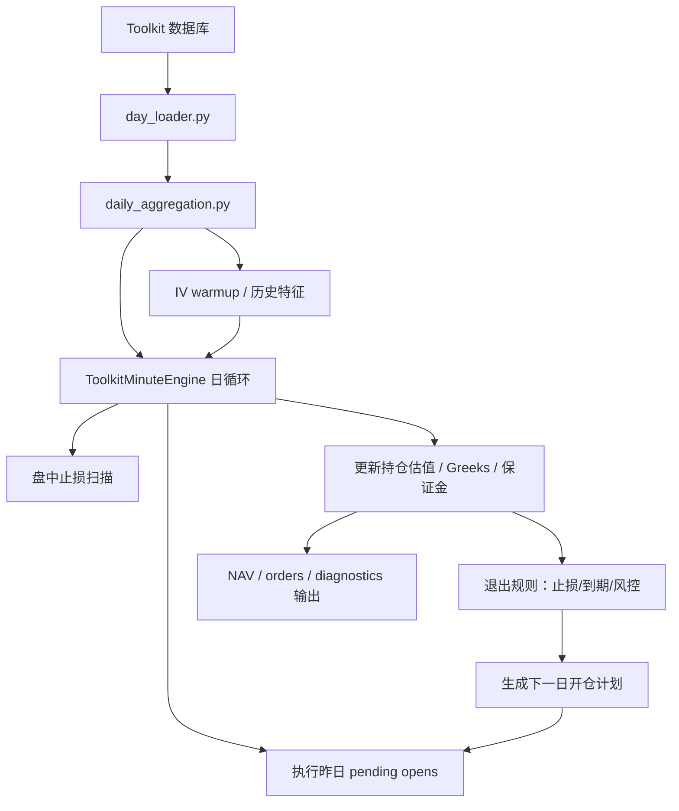
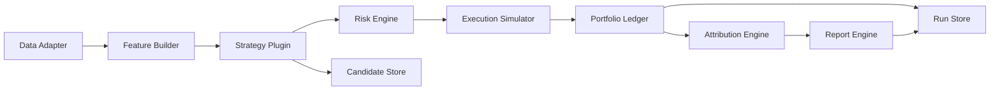

# 当前期权回测系统构造参考说明

日期：2026-05-06  
适用对象：IT、量化研究、风控、交易支持  
文档定位：本文说明当前 `server_deploy` 研究回测系统的实际构造，供 IT 建设公司级期权回测系统时参考。本文不是要求 IT 逐行复刻当前代码，而是说明当前系统已经验证过的设计、数据流、输出和仍需生产化改造的地方。

## 1. 当前系统一句话概括

当前系统是一个基于 Toolkit 数据源的“日频决策 + 分钟级执行/止损”的中国场内期权研究回测引擎。

它的核心特点是：

- 用日频聚合数据生成交易信号和候选合约。
- 用 T 日收盘信息生成 T+1 待开仓计划。
- T+1 使用分钟数据估算 TWAP/VWAP 成交。
- 持仓期间用分钟数据处理权利金止损。
- 每日盯市估值、更新保证金和 Greeks。
- 输出 NAV、orders、diagnostics、候选池和报告。

当前生产级入口为：

```bash
python src/toolkit_minute_engine.py \
  --config config_s1_p5_p3b_a0_group_stop15.json \
  --start-date 2022-01-01 \
  --end-date 2026-05-06 \
  --tag s1_example
```

## 2. 当前研究主线

当前 S1 研究主线收敛为 `P3B/A0`，配置入口：

```text
config_s1_p5_p3b_a0_group_stop15.json
```

继承链：

```text
config_s1_p5_p3b_a0_group_stop15.json
-> config_s1_baseline_b2_product_tilt075_stop15_ledet_term_pref.json
-> config_s1_baseline_b2_product_tilt075_stop15.json
-> config_s1_baseline_b2_product_tilt075_stop25.json
-> config_s1_baseline_b1_liquidity_oi_rank_stop25.json
-> config_s1_baseline_b0_all_products_stop25.json
```

这条主线可以理解为：

```text
全品种朴素卖权基准
+ 流动性/OI 排序
+ 品种预算倾斜
+ 乐得期限偏好
+ 组级 1.5x 权利金止损
```

当前主线仍是纯卖方策略，不启用保护腿、不启用比例价差、不启用主动 Delta 对冲。

## 3. 当前目录结构

| 目录 | 当前用途 | IT 参考意义 |
|---|---|---|
| `src/` | 回测引擎和业务模块 | 可参考模块拆分，但主引擎仍过大。 |
| `config_*.json` | 历史实验和当前主线配置 | 可参考配置继承，但生产系统应有配置注册表。 |
| `scripts/analysis/` | 回测结果分析 | 可参考分析指标和图表。 |
| `scripts/reports/` | 报告生成 | 可参考报告自动化流程。 |
| `scripts/launchers/` | 历史实验启动脚本 | 可参考批量实验命令，但不适合作为平台调度。 |
| `scripts/autoresearch/` | 自动研究队列、scorecard、audit、review | 可参考实验治理思路。 |
| `docs/` | 策略规格、实验设计、审计报告 | 是理解系统口径最重要的目录。 |
| `output/` | 回测输出 | 不应进入 Git，应由平台统一存储。 |
| `tests/` | 模块测试 | 可参考测试覆盖方向。 |
| `archive/` | 历史脚本和旧引擎 | 只用于追溯，不应作为新系统参考主路径。 |

## 4. 当前核心模块地图

| 模块 | 职责 |
|---|---|
| `toolkit_minute_engine.py` | 当前主调度器：交易日循环、开仓、盘中止损、估值、退出、输出。 |
| `day_loader.py` | Toolkit 数据读取、交易日、按日分钟行情、批量日频聚合。 |
| `daily_aggregation.py` | 从分钟行情生成日频 OHLC、成交量、持仓量、日高、IV/Delta enrich。 |
| `contract_provider.py` | 合约基础信息、乘数、到期日、交易所、费用/保证金辅助字段。 |
| `spot_provider.py` | 标的价格映射，优先真实期货/ETF，PCP 仅作兜底。 |
| `option_calc.py` | Black-76 / Black-Scholes IV 与 Greeks。 |
| `margin_model.py` | 交易所/券商保证金估算。 |
| `broker_costs.py` | 期权费用、平今、行权、指派费用。 |
| `execution_model.py` | 开仓、平仓、止损滑点。 |
| `open_execution.py` | T+1 待开仓执行、TWAP/VWAP、成交量约束、延期成交。 |
| `intraday_execution.py` | 分钟止损、日高预筛、异常价确认、下一分钟成交压力口径。 |
| `stop_policy.py` | 单合约、同代码、同品种同方向、整组、分层止损范围。 |
| `position_model.py` | 持仓对象，记录数量、成本、估值、Greeks、PnL。 |
| `portfolio_risk.py` | 保证金、cash Greeks、stress loss、品种/板块/相关组集中度。 |
| `portfolio_diagnostics.py` | 组合层诊断输出。 |
| `strategy_rules.py` | 通用策略规则和仍未完全拆分的 S1 辅助函数。 |
| `s1_contract_scoring.py` | S1 卖腿筛选、权利金质量评分、B4/B6 合约排序。 |
| `s1_budget_tilt.py` | B2C 品种预算倾斜。 |
| `s1_side_selection.py` | S1 P/C 侧选择、趋势置信度、侧预算调整。 |
| `s1_shadow_universe.py` | full shadow 候选池和未来标签输出。 |
| `s1_experimental_scoring.py` | B3/B4/B6 等研究型评分字段。 |
| `s1_pending_open.py` | S1 待开仓记录构造。 |
| `s3_rules.py` | S3 简化比例价差选腿规则。 |
| `vol_regime.py` | 波动率状态、冷却期、重开规则、低波/降波判断。 |
| `product_taxonomy.py` | 品种板块和相关组分类。 |
| `product_lifecycle.py` | 品种上市观察期和生命周期。 |
| `result_output.py` | NAV、orders、diagnostics、报告原始输出。 |
| `iv_warmup.py` | IV 历史预热和缓存。 |
| `config_loader.py` | JSON 配置和 `extends` 继承。 |

## 5. 当前数据流



这个流程的核心设计是：不做全量分钟事件回放，而是在日频框架下只对执行和止损使用必要分钟数据。

## 6. 当前交易日循环

当前主循环大致如下：

1. 加载配置、合约信息、交易日。
2. 根据品种池构建 SQL 过滤条件。
3. 预热 IV 历史。
4. 按批次预加载日频聚合数据。
5. 每个交易日开始时执行上一交易日生成的 pending open。
6. 对已有持仓执行盘中止损扫描。
7. 加载当日日频聚合，更新持仓价格、IV、Greeks、保证金。
8. 执行到期、止损、风控退出。
9. 计算波动率状态、组合风险、品种预算。
10. 扫描候选合约，生成下一交易日 pending open。
11. 写入 NAV 快照、diagnostics 和订单。
12. 回测结束后输出汇总文件和 Markdown 报告。

## 7. 当前数据表使用

| 数据 | 当前表/来源 | 用途 |
|---|---|---|
| 期权基础信息 | `option_basic_info` | 合约、执行价、到期日、类型、乘数、交易所。 |
| 期权分钟行情 | `option_hf_1min_non_ror` | 日频聚合、开仓 TWAP/VWAP、盘中止损、估值。 |
| 期货分钟行情 | `future_hf_1min` | 商品期权真实标的价格。 |
| ETF 分钟行情 | `etf_hf_1min_non_ror` | ETF 期权真实标的价格。 |
| 手续费表 | 本地/配置表 | 期权开平、平今、行权、指派费用。 |
| 保证金率表 | 本地/配置表 | 按品种/日期计算保证金。 |
| 品种分类 | `product_taxonomy.py` | 板块、相关组、风控聚合。 |

## 8. 当前配置系统

配置文件使用 JSON，并支持 `extends` 继承。优点是做控制变量实验很方便。例如：

- B0 定义朴素全品种基准。
- B1 只增加流动性/OI 排序。
- B2C 只增加品种预算倾斜。
- P3B 只增加乐得期限偏好。
- P5 A0 只把止损改为组级 1.5x。

这种方式非常适合研究，但公司级系统应补充：

- 配置注册表。
- 配置 schema 校验。
- 参数说明。
- 继承链展开后的完整快照。
- 配置版本号。
- 基准配置绑定。
- 实验 run_id。

## 9. 当前 S1 主线逻辑

当前 S1 是纯卖权收权利金策略，主要规则：

| 规则 | 当前口径 |
|---|---|
| 策略开关 | `enable_s1 = true`，S3/S4 默认关闭。 |
| 品种池 | 全品种基础上，P3B 使用乐得主流品种/期限偏好。 |
| 到期 | 默认次月，部分品种有期限偏好覆盖。 |
| Delta | `abs(delta) <= 0.10`。 |
| 合约梯队 | 每侧最多若干合约，当前主线保留分散执行价梯队。 |
| 价格过滤 | B1 起过滤低价合约。 |
| 排序 | 流动性、持仓量、权利金质量和品种预算倾斜。 |
| 保护腿 | 当前主线不启用。 |
| 止盈 | 当前主线不启用。 |
| 止损 | P5 A0 为组级 1.5x 权利金止损。 |
| 成交 | T 日信号，T+1 按分钟行情估计开仓成交。 |
| 保证金 | 使用券商/交易所保证金率表。 |
| 手续费 | 使用期货公司费用表。 |

## 10. 当前 S3 逻辑

当前 `s3_rules.py` 只实现了简化比例价差：

- 买较近 OTM 腿。
- 卖更远 OTM 腿。
- 支持比例候选。
- 支持保护腿选择。

但它还不是完整的管理人式比例价差系统。当前未完整覆盖：

- 多执行价卖腿。
- 高比例结构。
- 不同 delta 梯队。
- 净权利金覆盖率。
- breakeven。
- tail slope。
- 局部 long gamma 诊断。
- 与 S1 持仓合并后的冲突处理。

因此 IT 可参考多腿策略接口思路，但不要把当前 S3 视为成熟生产策略。

## 11. 当前风控结构

当前系统已有一批对公司级系统很有参考意义的风控能力：

| 风控 | 当前实现 |
|---|---|
| 总保证金上限 | `margin_cap`、`s1_margin_cap`。 |
| 单品种保证金 | `portfolio_product_margin_cap`。 |
| 单品种单方向 | `portfolio_product_side_margin_cap`。 |
| 板块集中度 | `product_taxonomy.py` + `portfolio_risk.py`。 |
| 相关组集中度 | `product_corr_group`。 |
| cash Greeks | Delta、Gamma、Vega、Theta。 |
| stress loss | 单笔和组合压力亏损估算。 |
| 波动率状态 | `vol_regime.py`。 |
| 冷却期 | 止损后品种/方向重开控制。 |
| 品种生命周期 | 新上市后观察期。 |
| 到期风险 | 临近到期提前处理。 |

这些能力在生产系统中应保留，但需要更标准化、更可配置、更可解释。

## 12. 当前盘中止损设计

盘中止损是当前系统最有价值的工程经验之一。

当前流程：

1. 根据开仓权利金和止损倍数计算止损价。
2. 先用当日最高价预筛。
3. 若日高未触发，则不加载该合约分钟细节。
4. 若可能触发，再扫描该合约分钟数据。
5. 检查成交量和异常价确认。
6. 根据配置选择触发分钟价格、下一分钟价格、下一分钟最高价等成交口径。
7. 记录止损订单、滑点、手续费、止损范围和触发原因。

这个设计解决了两个问题：

- 性能：避免所有持仓每天全量分钟扫描。
- 真实性：避免深虚值低流动性合约单笔异常价造成假止损。

## 13. 当前输出结构

当前标准输出包括：

| 文件 | 说明 |
|---|---|
| `nav_{tag}.csv` | 每日净值、PnL、回撤、保证金、Greeks、归因。 |
| `orders_{tag}.csv` | 每笔订单，包含开仓、平仓、止损、到期处理。 |
| `diagnostics_{tag}.csv` | 组合诊断、漏斗、预算、风险状态。 |
| `report_{tag}.md` | 简易汇总报告。 |
| candidate 输出 | S1 full shadow 或候选池分析时输出。 |

NAV 中已经包含：

- 总 NAV。
- 当日 PnL。
- 累计 PnL。
- 手续费。
- 保证金使用。
- 持仓数。
- cash Delta/Gamma/Theta/Vega。
- Delta/Gamma/Theta/Vega/Residual 归因。
- 策略 PnL。
- stress loss。
- 波动率状态。
- S1 shape 诊断。

## 14. 当前报告与研究流程

当前项目已经形成若干报告 skill 和分析脚本：

- S1 回测归因报告。
- 因子分层报告。
- B4/B6 实验报告。
- 品种池对比报告。
- 止损 sweep 报告。
- 自动研究 scorecard、audit、review。

公司级系统可以借鉴这个流程：

```text
回测结果
-> scorecard
-> audit
-> 期权逻辑 review
-> 图表分析
-> 飞书/Word 报告
```

这比单纯输出 CSV 更适合内部决策。

## 15. 当前性能优化经验

当前已经验证过的性能优化：

| 优化 | 说明 |
|---|---|
| 日频聚合 batch | 不逐日重复从分钟数据聚合所有合约。 |
| IV warmup cache | 历史 IV 特征缓存，避免长周期重复预热。 |
| 品种 SQL 过滤 | 只读取需要品种。 |
| 按需加载分钟数据 | 每日只加载待开仓和可能止损的合约。 |
| 日高预筛止损 | 未触及止损价的合约不进分钟扫描。 |
| 合约历史缓存 | 合约 IV/价格变动状态缓存。 |
| shadow 输出开关 | full shadow 不应默认拖慢主线回测。 |

公司级系统应把这些优化变成标准能力，而不是散落在策略代码里。

## 16. 当前系统值得 IT 参考的点

1. 日频信号 + 分钟执行的混合回测框架。
2. 配置继承方式，适合控制变量实验。
3. 真实标的价格优先的 spot 映射思路。
4. Black-76 / Black-Scholes 分市场计算 IV 和 Greeks。
5. 保证金、手续费、滑点模块化。
6. 盘中止损日高预筛。
7. 低流动性异常价确认。
8. NAV / orders / diagnostics 三层输出。
9. full shadow candidate universe，用于因子研究但不影响交易。
10. scorecard / audit / review 的实验治理框架。
11. 文档先行：每个重要实验先写设计文档，再写配置和运行。

## 17. 当前系统不建议直接照搬的点

| 问题 | 原因 | 建议 |
|---|---|---|
| `toolkit_minute_engine.py` 仍过大 | 调度、开仓、止损、估值、输出、实验逻辑仍在一个类里 | 公司级系统拆成引擎、策略、执行、风控、输出服务。 |
| 根目录配置太多 | 历史实验依赖文件名管理 lineage | 建立配置注册表和实验数据库。 |
| 研究层逻辑较多 | B3/B4/B5/B6/full shadow 与主线并存 | 生产主线和研究实验明确隔离。 |
| S3 尚不成熟 | 当前只是简化比例价差 | 不应直接作为生产策略。 |
| 输出文件本地化 | 当前输出在本地 `output/` | 平台应按 run_id 统一存储和索引。 |
| 测试偏模块级 | 长链路回归还不够 | 补端到端 smoke、成交路径、止损路径测试。 |
| 数据质量依赖人工排查 | 异常价和缺失数据虽有逻辑，但没有平台级质量面板 | 建立数据质量服务。 |

## 18. 建议的生产化改造架构



对应当前系统：

| 生产组件 | 当前参考模块 |
|---|---|
| Data Adapter | `day_loader.py`、`contract_provider.py`、`spot_provider.py`。 |
| Feature Builder | `daily_aggregation.py`、`iv_warmup.py`、`option_calc.py`。 |
| Strategy Plugin | `strategy_rules.py`、`s1_contract_scoring.py`、`s3_rules.py`。 |
| Risk Engine | `portfolio_risk.py`、`margin_model.py`。 |
| Execution Simulator | `open_execution.py`、`intraday_execution.py`、`execution_model.py`。 |
| Portfolio Ledger | `position_model.py`、`toolkit_minute_engine.py` 的持仓更新部分。 |
| Attribution Engine | `position_model.py`、`portfolio_diagnostics.py`。 |
| Report Engine | `result_output.py`、`scripts/reports/`。 |
| Experiment Manager | `scripts/autoresearch/`、配置继承链。 |

## 19. 对 IT 的落地建议

第一步不要追求“完全重写所有策略”，而应先复刻当前主线最关键的最小闭环：

```text
数据读取
-> 日频聚合
-> S1 主线候选生成
-> T+1 开仓
-> 分钟止损
-> 保证金/费用/Greeks
-> NAV/orders/diagnostics
-> 报告
```

只要这个闭环能够复现当前 P3B/A0 的关键指标，就说明底座基本可信。之后再扩展 S3、多腿结构、因子 shadow、自动研究和模拟盘接口。

## 20. 最小复现验收建议

IT 第一阶段可用以下方式验收：

1. 使用同一份配置 `config_s1_p5_p3b_a0_group_stop15.json`。
2. 使用同一时间区间，如 2022-01-01 至最近可用日期。
3. 使用同一数据源。
4. 输出相同字段的 NAV 和 orders。
5. 对比以下指标：

| 指标 | 要求 |
|---|---|
| 交易日数量 | 必须一致。 |
| 开仓合约数量 | 应高度一致。 |
| 止损次数 | 应高度一致。 |
| 权利金收入 | 应接近。 |
| 手续费 | 应接近。 |
| 保证金使用率 | 应接近。 |
| NAV | 若有差异，必须能解释来自成交口径或数据口径。 |
| 最大回撤 | 若有差异，必须能定位到订单级。 |

## 21. 当前系统已知工程债

当前仍需继续优化：

- 主引擎继续瘦身。
- `strategy_rules.py` 继续拆分。
- shadow candidate 输出和诊断输出继续模块化。
- 配置文件迁移到更规范目录。
- 补充端到端回归测试。
- 建立固定 smoke backtest。
- 输出字段 schema 固化。
- 报告图表路径和飞书导入流程标准化。

## 22. 结论

当前系统已经不是早期单脚本，而是一个较完整的期权策略研究工程。它最值得 IT 参考的不是某一段具体代码，而是以下几个已被研究过程验证的原则：

- 期权回测必须同时处理日频决策和分钟级路径风险。
- 卖方策略必须重点关注权利金留存、止损、费用、滑点、保证金和尾部聚集。
- 商品、股指、ETF 期权必须分市场处理。
- 候选池、成交、风控、归因和报告都需要留痕。
- 普通回测和 full shadow 因子研究必须隔离。
- 所有实验必须可复现、可审计、可对比。

公司级系统应把当前研究系统的有效经验平台化，同时用更清晰的架构解决当前研究原型中主引擎过大、配置分散、研究层与主路径混杂的问题。
